# Walking Skeleton MVP — Car-Share Application

## MVP Flow

The Walking Skeleton represents the minimum end-to-end process required for a user to rent a car.

```mermaid
flowchart TD

    R[Renter]
    S[Car-Share System]
    O[Car Owner]

    R -->|1. Register / Login| S
    R -->|2. Search for Available Cars| S
    S -->|3. Display Available Cars| R# LAB 02 — 2D Story Map: Car-Share Application

```mermaid
flowchart TB

    %% =========================
    %% ACTIVITIES
    %% =========================

    A["ACCOUNT MANAGEMENT"]
    B["CAR MANAGEMENT"]
    C["CAR DISCOVERY"]
    D["BOOKING"]
    E["PAYMENT & RENTAL"]
    F["AFTER RENTAL"]

    %% =========================
    %% MVP / WALKING SKELETON
    %% =========================

    A1["1. Create Account"]
    A2["2. Login"]

    B1["3. Add Car"]
    B2["4. Add Car Details"]

    C1["5. Search Available Cars"]
    C2["6. Search by Location"]
    C3["7. View Car Details"]
    C4["8. View Rental Price"]

    D1["9. Select Date & Time"]
    D2["10. Request Car"]
    D3["11. Receive Booking Request"]
    D4["12. Approve Booking"]
    D5["13. Receive Confirmation"]

    E1["14. Make Payment"]
    E2["15. Pickup Instructions"]
    E3["16. Return Car"]
    E4["17. Confirm Return"]

    F1["18. View Booking History"]
    F2["19. Rate Car & Owner"]
    F3["20. Rate Renter"]

    %% =========================
    %% STORY MAP STRUCTURE
    %% =========================

    A --> A1
    A --> A2

    B --> B1
    B --> B2

    C --> C1
    C --> C2
    C --> C3
    C --> C4

    D --> D1
    D --> D2
    D --> D3
    D --> D4
    D --> D5

    E --> E1
    E --> E2
    E --> E3
    E --> E4

    F --> F1
    F --> F2
    F --> F3

    %% =========================
    %% USER FLOW
    %% =========================

    A2 -.-> C1
    C4 -.-> D1
    D5 -.-> E1
    E1 -.-> E2
    E2 -.-> E3
    E3 -.-> E4
    E4 -.-> F1
    F1 -.-> F2
    F2 -.-> F3
```

## Walking Skeleton MVP

The first release should contain only the stories required to complete the basic car-rental journey:

**MVP Stories:**

- Create Account
- Login
- Search Available Cars
- View Car Details
- View Rental Price
- Select Date & Time
- Request Car
- Receive Booking Request
- Approve Booking
- Receive Confirmation
- Make Payment
- Pickup Instructions
- Return Car
- Confirm Return

### MVP Flow

```mermaid
flowchart LR

    A["Register / Login"]
    B["Search Available Cars"]
    C["View Car Details"]
    D["Select Date & Time"]
    E["Request Car"]
    F["Owner Approves"]
    G["Booking Confirmation"]
    H["Payment"]
    I["Pickup"]
    J["Return"]

    A --> B
    B --> C
    C --> D
    D --> E
    E --> F
    F --> G
    G --> H
    H --> I
    I --> J
```


    R -->|4. Select a Car| S
    S -->|5. Display Car Details and Price| R
    R -->|6. Select Date and Time| S
    R -->|7. Submit Booking| S
    S -->|8. Send Booking Request| O
    O -->|9. Approve Booking| S
    S -->|10. Send Booking Confirmation| R
    R -->|11. Make Payment| S
    S -->|12. Confirm Payment| R
    R -->|13. Pick Up Car| O
    R -->|14. Return Car| O
    O -->|15. Confirm Car Return| S
